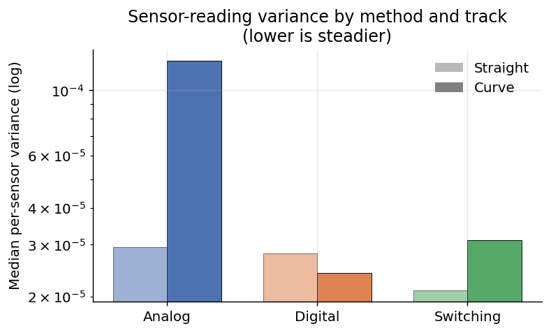
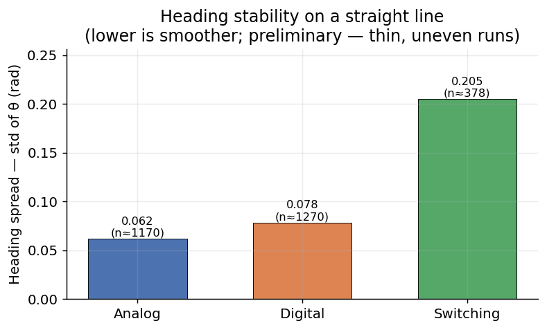
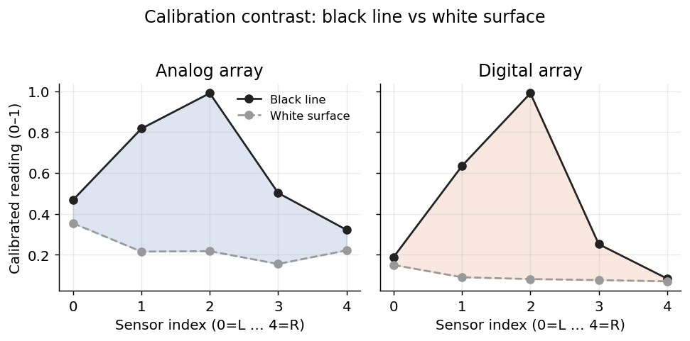
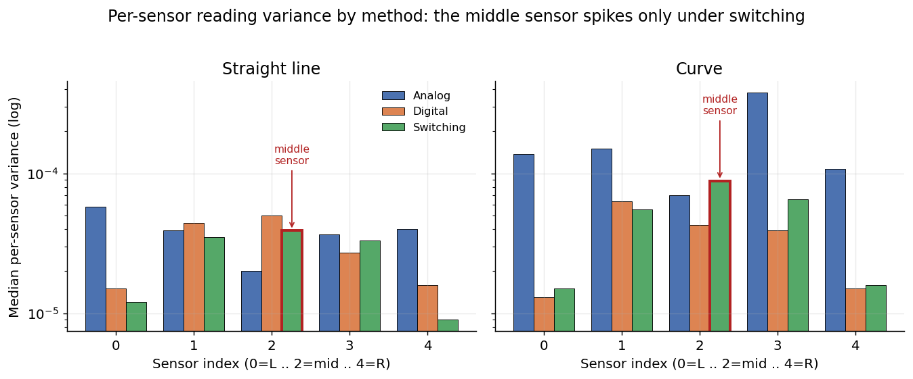
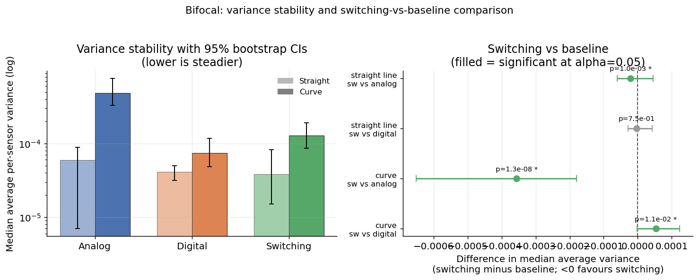

<div align="center">

# Bifocal

**A line-following robot that reads its sensors two ways, analog and digital, and every control cycle steers with whichever reading is more stable.**


[](LICENSE)



</div>

Bifocal is the firmware and experimental study for a **Pololu 3Pi+ 32U4**
line-following robot. It reads the same 5-element infrared sensor array two ways.
One is a high-resolution **analog** read; the other is a robust **digital**
(RC decay-time) read. On every control cycle the robot measures how consistent
each read is, using variance, and steers with the array that is currently
steadier. It needs no extra hardware, only the sensors already on the board.

The figure above is the main result, computed from the robot's own trial logs.
Switching cuts the analog array's worst-case noise (its variance on curves drops
by about 75 percent), but the switching itself adds some heading wobble. That is
the central trade-off this repository documents: steadier readings, slightly less
smooth motion. The firmware here goes further than the original study: it adds a
full 5-sensor controller, a debounced switch, an inverse-variance fusion mode,
optional filtering, clean logging, host tests, and compile CI.

## Gallery

The figures come from [`analysis/make_gallery.py`](analysis/make_gallery.py),
[`analysis/sensor_noise.py`](analysis/sensor_noise.py), and
[`analysis/statistics.py`](analysis/statistics.py). All are generated from the raw
trial CSVs in `data/`. No values are entered by hand.

<table>
<tr>
<td align="center"><br><sub><b>Variance by method</b>: switching removes analog's curve spike and ties digital</sub></td>
<td align="center"><br><sub><b>Heading spread</b>: analog holds the straightest line; switching wobbles (preliminary)</sub></td>
</tr>
<tr>
<td align="center"><br><sub><b>Calibration contrast</b>: the line reads as a peak on sensor 2; digital's floor is tighter</sub></td>
<td align="center"><br><sub><b>Middle-sensor noise</b>: sensor 2 is noisiest under switching, inherited from the digital branch</sub></td>
</tr>
<tr>
<td align="center" colspan="2"><br><sub><b>Statistics</b>: average variance with 95% bootstrap confidence intervals, and switching-vs-baseline differences</sub></td>
</tr>
</table>

## About

Bifocal started as an undergraduate robotics assignment, getting a Pololu 3Pi+ to
follow a black line on a white floor, and grew into a small study around one
question. If a robot can sense the same line two different ways, can it decide by
itself, moment to moment, which way to trust?

A reflectance sensor can be read in two modes, and the two behave differently.
An **analog** read gives a smooth, high-resolution value that is precise but
noisy, with occasional large spikes. A **digital** read charges the sensor's
capacitor and times how long it takes to discharge, which gives a cleaner, almost
thresholded value that is robust but coarser. Most robots pick one mode and keep
it. Bifocal runs both at once and chooses between them continuously.

The rule is simple. Each cycle the robot samples both arrays, computes the
average per-sensor variance of each, and steers using the array with the lower
variance. The idea is to follow the sensor that is behaving well right now rather
than the one that is better on paper. The whole mechanism is software and costs
only a few milliseconds of sampling per cycle.

To test whether this helps, the robot was run as a controlled experiment. Three
strategies, analog only, digital only, and variance-based switching, were each
driven over straight and curved track segments while the firmware logged
per-sensor variance and encoder-derived heading. Re-analysing those logs gives a
mixed result. Switching is a clear improvement over raw analog: median sensor
variance falls by about 28 percent on straights and about 75 percent on curves,
and it removes analog's roughly tenfold worst-case spikes. Against the digital
array, which is already steady, switching only ties or slightly loses. On the
thin heading data, the extra switching makes motion visibly less smooth than
analog alone. Readings get steadier, motion gets a little rougher.

That result motivated the current firmware. If the per-tick flip-flopping of the
switch is what costs smoothness, then a debounced switch, an inverse-variance
blend, a full 5-sensor controller, and optional filtering should each help. All
of them are implemented here so they can be tried on the robot next.

This repository holds the whole project: the firmware that runs all four
strategies, the raw trial data, the analysis that turns it into the figures
above, the host tests and CI, and the
[technical paper](docs/variance-based-sensor-switching-paper.pdf) that wrote up
the original study. The encoder and odometry scaffolding follows University of
Bristol course material by Paul O'Dowd.

## How it works

The robot reads a 5-element downward-facing IR reflectance array
(index `0` = left, `2` = middle, `4` = right) in two independent ways.

- **Analog** (`analoglinesensors.h`): `analogRead()` of each phototransistor,
  averaged over several samples. Higher resolution, more noise. An optional EMA
  low-pass filter is available (off by default).
- **Digital** (`digitallinesensors.h`): charge the sensor capacitor, then time
  its discharge. Longer time means a darker surface. Cleaner contrast, and
  effectively a robust thresholded read.

Both are normalised to the range 0 to 1 per sensor by a spin-in-place
**calibration** that captures each sensor's minimum (white) and maximum (black).

**The switch.** Each cycle the firmware computes the average per-sensor variance
of each array and prefers the steadier one. To stop the selection flip-flopping
every tick, the switch is debounced: it only changes array when the alternative
is better by at least `SWITCH_MARGIN`, and never more often than `SWITCH_DWELL_MS`.

```text
if (otherVariance + SWITCH_MARGIN < currentVariance
    and time_since_last_switch >= SWITCH_DWELL_MS)
    switch arrays
```

An alternative to the hard pick is `METHOD_FUSION`, which blends the two arrays'
line-position errors by inverse variance, so the steadier array simply counts for
more without a discrete switch.

**Steering.** By default the robot computes a full 5-sensor weighted line
position (weights -2, -1, 0, 1, 2, normalised to the range -1 to 1). The turn
term is produced either by a simple proportional law or by a small PID controller
(`STEER_MODE`). The original 2-sensor measurement (sensors 1 and 3 only) is still
available behind `USE_FULL_POSITION`.

```text
error   = weighted 5-sensor line position, in [-1, 1]
turn    = error            (simple)   or   PID(error, dt)   (PID)
LeftPWM  = BiasPWM + MaxTurnPWM * turn
RightPWM = BiasPWM - MaxTurnPWM * turn
```

Wheel-encoder **odometry** (`kinematics.h`) integrates heading (`theta`). Every
control tick is written as one timestamped CSV row for offline analysis.

## Features

- **Four interchangeable strategies** selected with one `#define`
  (`FOLLOW_METHOD`): analog only, digital only, variance-based switching, and
  inverse-variance fusion.
- **Full 5-sensor weighted line position** with a simple proportional or PID turn
  term. The old 2-sensor measurement stays available as a fallback.
- **Debounced switching** with a hysteresis margin and a minimum dwell time, to
  stop the per-tick flip-flopping that adds heading wobble.
- **Inverse-variance fusion** that blends the two arrays instead of hard-picking.
- **Non-blocking rolling variance** over a per-sensor ring buffer, so the switch
  decision no longer stalls the control loop to resample each tick.
- **Signal conditioning**: an optional EMA low-pass filter, a median-based
  outlier clamp that rejects lone spikes, and a per-sensor gain trim, all off or
  neutral by default so the unfiltered pipeline is unchanged.
- **Adaptive speed** that lowers the forward bias as the steering demand rises,
  so the robot slows for curves and runs faster on straights.
- **Live serial tuning** to change method, PID gains, and speed at runtime, plus
  **EEPROM calibration persistence** so a good calibration survives a reboot.
- **Configurable odometry geometry** (`setGeometry`) with a standalone
  calibration sketch and a written procedure.
- **Clean, fixed-rate, timestamped CSV logging**
  (`t_ms,theta,method,line_error,var_a,var_d,bias`), one row per control tick.
- **Host unit tests**, an **offline replay simulation** that compares all four
  strategies on identical inputs, **compile CI**, and a **statistical analysis**
  with bootstrap confidence intervals.

Optional research modules, each behind an opt-in flag and off by default:

- **Kalman fusion** (`kalman.h`): a 1D Kalman filter that fuses the two arrays
  using their live variance as the measurement noise, the principled form of the
  inverse-variance blend.
- **Learned switching policy** (`policy.h`): a tiny logistic policy trained
  offline that decides which array to trust, in place of the fixed margin.
- **Line-loss recovery** (`recovery.h`): coast small gaps and sweep to reacquire
  the line instead of stopping.
- **Disagreement detector** (`disagreement.h`): flags line edges, junctions, and
  anomalies from where the analog and digital reads disagree.
- **Online recalibration**: adapts each sensor's calibration to changing light
  while running.
- **A parameter sweep** with a Pareto frontier, **Monte Carlo** confidence
  intervals, a **WebAssembly** sim demo, and a one-command **reproduce.sh**.

## Tech stack

| | Tool | Role |
|-|------|------|
|  | Arduino (AVR toolchain) | Build and flash the ATmega32U4 firmware |
|  | C++ | Firmware, written as an Arduino sketch plus headers |
|  | Python | Data analysis and figure generation |
|  | Jupyter | Exploratory notebook (`analysis/RT_Results.ipynb`) |
|  | pandas | Reading and wrangling the trial CSVs |
|  | NumPy | Variance, statistics, array maths |
|  | matplotlib / seaborn | Plotting the gallery figures |

## Hardware

| Component | Detail |
|-----------|--------|
| Controller | Pololu **3Pi+ 32U4** (ATmega32U4) or a Romi/32U4 control board |
| Line sensors | Onboard 5-element IR reflectance array |
| Drive | Two micro-metal gearmotors with quadrature encoders |
| Track | Black line on a white surface (invert calibration to reverse) |

Pin assignments are at the top of each header (`A_LS_*`, `D_LS_*`, `L_PWM`,
encoder pins, and so on). Adjust them if your wiring differs.

## Building

The firmware is a standard Arduino sketch. The sketch folder name must match the
`.ino` file name, so keep them together as `firmware/line_following/`.

### Arduino IDE

1. Install board support for the **Pololu A-Star 32U4 / Arduino Leonardo**
   (ATmega32U4) core.
2. Open `firmware/line_following/line_following.ino`.
3. Select the board and port, then **Upload**.

### arduino-cli

```bash
arduino-cli core install arduino:avr
arduino-cli compile --fqbn arduino:avr:leonardo firmware/line_following
arduino-cli upload  --fqbn arduino:avr:leonardo -p COM3 firmware/line_following
```

### PlatformIO

```bash
pio run                 # build the default env
pio run -t upload       # build and flash
```

On boot the robot prints `***RESET***`, spins to calibrate, beeps about ten times
(move it to the start line during this window), then runs a trial. It logs one
CSV row per control tick over serial at 9600 baud, starting with a header line
`t_ms,theta,method,line_error,var_a,var_d`. See
[docs/build-and-ci.md](docs/build-and-ci.md) for all build paths and caveats.

## Configuration

Edit the `#define`s at the top of `line_following.ino`. PID gains live in
`steering.h`.

| Macro | Purpose | Default |
|-------|---------|---------|
| `FOLLOW_METHOD` | `METHOD_ANALOG`, `METHOD_DIGITAL`, `METHOD_SWITCHING`, or `METHOD_FUSION` | `METHOD_SWITCHING` |
| `USE_FULL_POSITION` | `1` uses the 5-sensor position, `0` the old 2-sensor measurement | `1` |
| `STEER_MODE` | `STEER_SIMPLE` (proportional) or `STEER_PID` | `STEER_PID` |
| `SWITCH_MARGIN` | switching hysteresis: minimum variance advantage to switch arrays | `0.0005` |
| `SWITCH_DWELL_MS` | switching: minimum time on an array before switching again | `300` |
| `FUSION_EPS` | inverse-variance guard so a zero variance cannot dominate | `0.0001` |
| `CONTROL_PERIOD_MS` | control loop period (also the log rate) | `100` |
| `MIN_BIAS_PWM`, `MAX_BIAS_PWM` | adaptive-speed forward bias band (slow on turns, fast on straights) | `20`, `40` |
| `MaxTurnPWM` | maximum steering differential | `20` |
| `USE_SAVED_CALIBRATION` | `1` loads calibration from EEPROM and skips the spin | `0` |
| `FUSION_USE_KALMAN` | `METHOD_FUSION` uses the Kalman filter instead of the inverse-variance blend | `0` |
| `SWITCH_USE_POLICY` | `METHOD_SWITCHING` uses the learned policy instead of the fixed margin | `0` |
| `ENABLE_RECOVERY` | handle line loss with coast/search recovery instead of stopping | `0` |
| `LOG_DISAGREEMENT` | compute the analog/digital disagreement each tick and add a CSV column | `0` |
| `MAX_RESULTS` | logged control ticks per trial | `80` |
| `ANALOG_STOP_SUM`, `DIGITAL_STOP_SUM` | end-of-line thresholds | `0.4`, `0.1` |
| `DEBUG_INSPECT` | `1` streams calibrated readings and variance forever (tuning) | `0` |

Switching between strategies is a one-line change to `FOLLOW_METHOD`. This is how
the datasets in `data/results/` were produced.

Many of these can also be changed at runtime over serial without recompiling.
Send `?` for the current settings, `m <0-3>` to pick the method, `p <kp> <ki> <kd>`
to set PID gains, `s <min> <max>` to set the speed band, and `w` / `l` / `c` to
save, load, or clear the EEPROM calibration.

## Experimental method

Each of the three original strategies was run over two track types, straight and
curve. Per run the firmware recorded per-sensor **variance** over time and
encoder-odometry **heading** (`theta`). Procedure, from the paper: charge the
battery, place the middle sensor over the line, run the spin calibration, realign
to the start, then record until the end of the line is detected.

## Results

Numbers are re-derived from the raw CSVs in `data/results/`. Medians are quoted
where the distributions are dominated by rare spikes (see
[limitations](#known-limitations)).

**Sensor-reading variance** (lower is steadier):

| Comparison | Straight (median) | Curve (median) | Verdict |
|------------|-------------------|----------------|---------|
| Switching vs Analog | down 28% | down 75% | clear win |
| Switching vs Digital | down 25% | up 29% | ties, slightly worse on curves |

- The real benefit of switching is removing analog's worst case. Analog's mean
  curve variance (about 0.0057) is roughly ten times switching's (about 0.00054).
- Against digital, switching only ties or slightly loses, because digital is
  already the low-variance baseline. The value of switching is avoiding analog's
  spikes.
- Noisiest sensor: analog at the edges, digital at index 1, switching at the
  middle sensor (index 2). Under switching the middle sensor carries 1.75x to
  2.34x the side-sensor average, inherited from the digital branch's steep gain
  there (see [docs/sensor-noise.md](docs/sensor-noise.md)).

**Calibration contrast** (middle sensor, black to white): analog goes 0.99 to
0.22 (a gap of about 0.77), digital goes 0.99 to 0.08 (a gap of about 0.91), so
digital separates the line from the background better.

**Heading smoothness** (straight line, preliminary): analog held the straightest
line (std about 0.062 rad), digital was in the middle (about 0.078), and
switching wobbled most (about 0.205). Treat this as directional only, because the
switching run has about three times fewer samples than analog or digital.

**Takeaway.** The variance-based switch improves sensor reliability, but the
switching itself adds navigation instability. This matches the paper's
conclusion: an accuracy-versus-smoothness trade-off, not a one-sided win. The
debounced switch and fusion mode added here target exactly that instability.

## Reproducing the analysis

```bash
python -m venv .venv && source .venv/bin/activate   # Windows: .venv\Scripts\activate
pip install pandas numpy matplotlib seaborn jupyter

python analysis/make_gallery.py        # regenerate the main gallery figures
python analysis/sensor_noise.py        # regenerate the middle-sensor figure and stats
python analysis/statistics.py          # bootstrap CIs and significance tests
jupyter notebook analysis/RT_Results.ipynb
```

`RT_Results.ipynb` loads its combined `theta.csv` and `variances.csv` from a
remote URL, so it runs without local paths. The two scripts read the per-scenario
CSVs in `data/` directly and defend against the PuTTY headers, label rows, and
delimiter-free theta dumps in the raw logs.

## Testing and continuous integration

The pure logic runs and is tested on the host PC, no hardware required.

```bash
cd tests && make test        # builds and runs all suites under g++ -Wall
```

The suite stubs the Arduino API (with injectable `analogRead`/`digitalRead`) and
checks the population-variance formula, the outlier clamp, the average-variance
helper, and the differential-drive pose and heading integration. On every push
and pull request, GitHub Actions
([.github/workflows/ci.yml](.github/workflows/ci.yml)) compiles the sketch with
both arduino-cli and PlatformIO.

The offline replay harness compares all four strategies on one identical, seeded
set of synthetic inputs and prints smoothness and tracking metrics:

```bash
cd sim && make run
```

This is the apples-to-apples comparison the physical runs could not give. On the
synthetic track, fusion produces the smoothest steering while tracking nearly as
tightly as digital, and the debounce holds the switch to a modest rate.
`cd sim && make sweep` then `python analysis/pareto.py` sweeps the switch margin
and dwell over many seeds and plots the tracking-vs-smoothness Pareto frontier;
the best region is a low dwell (1 to 2 ticks) with a margin near 0.001 to 0.002.

To rebuild and re-verify everything (host tests, sim, and every figure and stat)
in one command:

```bash
bash reproduce.sh
```

## Project structure

```text
bifocal/
├── firmware/
│   ├── line_following/            # main Arduino sketch (open this folder in the IDE)
│   │   ├── line_following.ino      #   loop, strategy dispatch, adaptive speed, serial CLI, logger
│   │   ├── steering.h              #   5-sensor line position, 2-sensor fallback, PID_c
│   │   ├── analoglinesensors.h     #   AnalogLineSensors_c (rolling variance, filters, online recal)
│   │   ├── digitallinesensors.h    #   DigitalLineSensors_c (rolling variance, filters, online recal)
│   │   ├── persistence.h           #   EEPROM calibration save/load
│   │   ├── kalman.h                #   1D Kalman line-position fusion (opt-in)
│   │   ├── policy.h                #   learned logistic switching policy (opt-in)
│   │   ├── recovery.h              #   line-loss coast/search recovery (opt-in)
│   │   ├── disagreement.h          #   analog/digital disagreement detector (opt-in)
│   │   ├── motors.h                #   Motors_c (PWM and direction)
│   │   ├── encoders.h              #   quadrature encoder ISRs (AVR register-level)
│   │   └── kinematics.h            #   Kinematics_c (configurable differential-drive odometry)
│   └── tools/
│       └── odometry_calibration/   #   standalone sketch to measure wheel geometry
├── data/
│   ├── calibration/               # 8 CSVs: per-sensor readings and variance
│   └── results/                   # 11 CSVs: theta and per-sensor variance, all methods
├── analysis/
│   ├── RT_Results.ipynb           # exploratory notebook (pandas, seaborn)
│   ├── make_gallery.py            # regenerates the main gallery figures
│   ├── sensor_noise.py            # middle-sensor noise investigation
│   ├── statistics.py              # bootstrap CIs and significance tests
│   ├── train_policy.py            # trains the learned switching policy
│   └── pareto.py                  # sweep Pareto frontier and Monte Carlo CIs
├── sim/                           # offline replay harness + parameter sweep (make run / make sweep)
├── tests/                         # host unit tests, six suites (make test)
├── web/                           # WebAssembly sim demo (build with emscripten)
├── gallery/                       # generated figures (checked in)
├── docs/                          # paper, addendum, and per-feature notes
├── assets/logos/                  # tech-stack logos used by this README
├── .github/workflows/ci.yml       # compile CI (arduino-cli + PlatformIO)
├── reproduce.sh                   # one-command build + test + figures
├── Dockerfile
├── platformio.ini
├── AUTHORS
├── CONTRIBUTING.md
├── LICENSE
└── README.md
```

Every data CSV is distinct (verified by checksum), so none were removed. Only a
duplicated copy of the firmware and its zip were cleaned up.

## Known limitations

These describe the existing dataset in `data/`. The new firmware logger addresses
the format issues (2 and 3) for any runs collected from now on.

1. **Thin heading data.** Theta logs are short and uneven, and switching has
   about three times fewer samples, so the smoothness numbers are indicative
   rather than statistically robust.
2. **Accumulating serial dumps.** The old theta logger reprinted its whole
   history on each line with no delimiters, so the analysis takes the longest run
   per file. The new logger emits one clean timestamped row per tick instead.
3. **PuTTY log headers** are embedded in several CSVs and must be stripped.
4. **The `-1.00` sentinel** appears in the switching theta log. Confirm its
   meaning against the firmware before treating those rows as data.
5. **Outlier-dominated means.** Variance means are skewed by rare spikes, so the
   conclusions lean on medians.

## Status

The original study's roadmap is now implemented in firmware and tooling:

- **Controller.** Full 5-sensor weighted position and a PID option; a debounced
  switch (hysteresis plus dwell); an inverse-variance fusion mode; adaptive speed;
  and a live serial interface to change method, gains, and speed at runtime.
- **Sensing.** Non-blocking rolling variance; an optional EMA low-pass filter, a
  median outlier clamp, and a per-sensor gain trim; and a written investigation
  of the noisy middle sensor ([docs/sensor-noise.md](docs/sensor-noise.md)).
- **Odometry.** Configurable wheel geometry with a calibration helper sketch and
  procedure ([docs/odometry-calibration.md](docs/odometry-calibration.md)). The
  heading formula was corrected during the refactor.
- **Data.** Clean, fixed-rate, timestamped CSV logging, and EEPROM calibration
  persistence.
- **Tooling.** A PlatformIO project, compile CI, host unit tests (six suites), an
  offline replay simulation with a parameter sweep and Pareto frontier
  ([sim/](sim/), [docs/parameter-sweep.md](docs/parameter-sweep.md)), a
  statistical re-analysis with bootstrap confidence intervals
  ([docs/statistics.md](docs/statistics.md)), a WebAssembly demo ([web/](web/)),
  and a one-command reproduce script.
- **Research modules (opt-in).** Kalman line-position fusion, a learned logistic
  switching policy, line-loss recovery, disagreement-based feature detection, and
  online recalibration. Each is off by default and host-tested; flip its flag in
  the sketch to try it.

Still open, because it needs the physical robot: tune the PID gains and the
switch margin and dwell on the track, and collect more and longer clean-CSV runs
(especially for switching and fusion) to make the heading-smoothness comparison
statistically solid. The addendum ([docs/addendum.md](docs/addendum.md)) records
what changed since the paper.

## Firmware fixes in the refactor

The core algorithm's behaviour was preserved. These changes removed real bugs and
undefined behaviour: added the missing `motors.initialise()`, removed a stray
brace and an always-on `while(true)` block that stranded `loop()`, made
`calculateVariance()` actually return, replaced variable-length arrays with fixed
ones, fixed the analog sampling loop that discarded all but the last sample, made
analog and digital average-variance consistent so the switch compares like with
like, de-collided the two headers' pin macros (`A_` and `D_` prefixes), fixed a
`thetaLog` buffer overflow, and corrected the differential-drive heading update to
`deltaTheta = (dR - dL) / wheelSeparation` (previously divided by twice the
separation). Re-baseline before comparing new theta values to old runs.

## Credits and licence

Built by **Tiberiu Toca** and **Ronaldo Balram** (see [AUTHORS](AUTHORS)).

The full write-up is in
[`docs/variance-based-sensor-switching-paper.pdf`](docs/variance-based-sensor-switching-paper.pdf):
*Investigating Line-Following Robot Navigation through Variance-Based Sensor
Switching: A Hybrid Approach to Optimizing Sensor Performance* (submitted as
nz20469 and xi20942). Encoder and odometry scaffolding and inline guidance credit
Paul O'Dowd (University of Bristol course material).

Released under the [MIT License](LICENSE).
